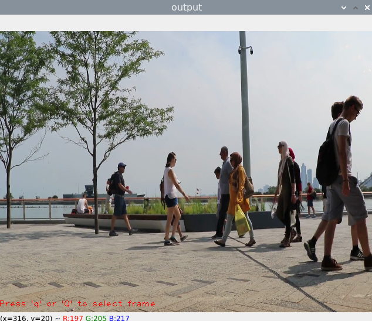
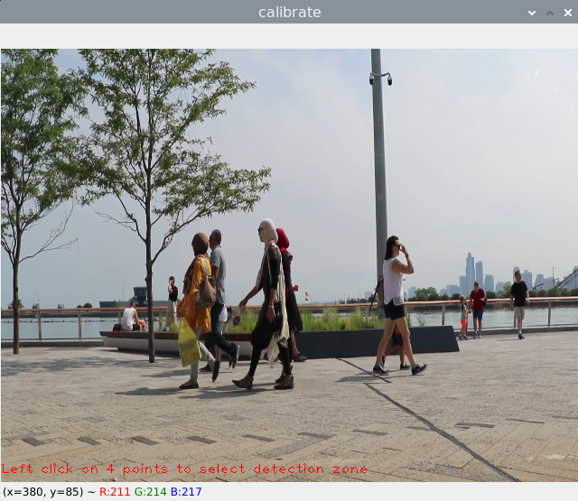

# Swimming Pool Drowning Detector

This project is the final submission for COMP-5650: Internet of Things. We have used a Tensorflow Lite Efficent Net model with a Raspberry Pi Model 4 to monitor a specific area (say a pool) for humans. If the number of humans in the area goes down, then they might have drowned.

Software/Hardware used:
- Raspberry Pi Model 4 (1GB RAM)
- Raspbian 64-bit OS
- Raspberry Pi Camera V2
- Python 3.10.2
- Tensorflow lite support module v0.4.3

The flowchart of our algorithm is as follows:

The main running program is `detect.py`. The following arguments can be passed to it:
- `--model`         :   Path to the Tensorflow Lite model (with metadata).
                        Default is `efficientdet_lite0.tflite`.
- `--source`        :   Path to the detection source or camera.
                        Default is 0 (default webcam).
- `--frameWidth`    :   Width of frame to capture from camera.
                        Default is 640px.
- `--frameHeight`   :   Height of frame to capture from camera.
                        Default is 480px.
- `--numThreads`    :   Number of CPU threads to run the model.
                        Default is 4.
- `--calibrate`     :   Runs the calibration program to set detection area.

---

## Calibration Process

If the calibration flag is triggered during launch, it runs the calibration program first. 

First the source runs and the user is prompted to press 'q' or 'Q' to select a frame:

After a frame is selected, it is displayed in a new window and the user is asked to select 4 points on the frame to define the detection zone:

Once the 4 points have been selected, the final detection zone is displayed for the user.

---

The final detection points are stored in a text file `ref.txt`.

> If this text file is not found on normal launch, then the calibration is run automatically.

## Detection

The detection zone is pulled from the text file, and transformed into 3 polygons. The original detection zone (**actual DZ**), an expanded version (**outer DZ**) and a shrunken version (**inner DZ**).

The inference is done on the source and bounding boxes are made on the detected humans. We use the midpoint of the bounding boxes as a reference point.

Two counters are initialized, `real_count` and `expected_count`. 

If a person is in the area between the outer DZ and actual DZ, we can say the person has entered the detection zone and the `expected_count` is incremented by 1.  
Similarly, if a person is in the area between the inner DZ and actual DZ, we can say the person has exited the detection zone and the `expected_count` is decremented by 1.

The `real_count` is the number of people who are detected in the actual DZ.

If the `real_count` goes lesser than the `expected_count`, then a warning timer of 15 seconds is initialized. If the count becomes balanced in that time then the timer is aborted. However, if the count is still less and the timer runs out, then the alarm is triggered. For the purposes of testing the program just prints "**Person Missing!!!**", but it can be replaced by anything, like trigger to a buzzer, or an alert to a mobile phone. 

> Timer in action
> 
> 

> Alarm triggered
>
> 

## Conclusion

We achieve an average of 8-9 FPS with an efficientdet-lite0 model, with a detection accuracy of about 70%. For better accuracy and FPS, we can retrain the model with a bigger dataset focussed on just humans. Also, for detection in a swimming pool, a dataset with just the upper half of the human body needs to be used as only that part of the swimmers is seen.